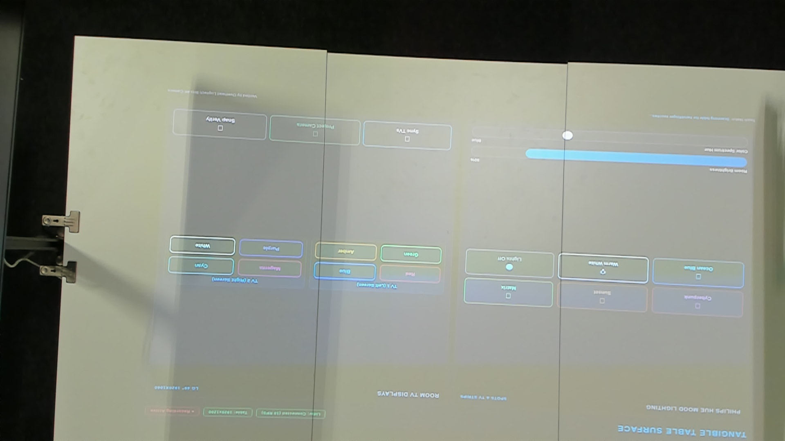

# Tangible Table Control Surface Demo

An interactive physical-digital tabletop interface built for the AIXIA Hackathon room. Projects an interactive UI onto the 1.5m × 1.5m table surface, tracks physical hand and finger touches in real-time via the **Slamtec RPLIDAR C1**, drives the **Philips Hue** ceiling spots & TV backstrips, synchronizes the **LG 49" TV monitors**, and streams the overhead **Logitech Brio 4K camera** directly onto the table surface.



---

## 🌟 Key Features

1. **Physical Hand & Touch Tracking via Lidar**:
   - Ingests raw sweeps from `ws://192.168.42.24/scan`.
   - Filters scan points within the physical table bounding box (1500mm × 1500mm).
   - Clusters adjacent scan points into distinct touch centers using Euclidean clustering.
   - Converts millimeter coordinates into normalized UV screen coordinates `[0.0, 1.0]`.
   - Corrected coordinate orientation: Horizontally mirrored (`1.0 - norm_u`) to match the ceiling projector view.

2. **Interactive UI Controls on the Table**:
   - **Scene Preset Buttons**: Instant triggers for *Cyberpunk*, *Sunset*, *Matrix*, *Ocean*, *Studio White*, and *Off*.
   - **Continuous Sliders**: Hand-draggable continuous sliders for **Master Brightness** and **Hue Spectrum** (0°–360°).
   - **TV Color Triggers**: Independent touch buttons to paint TV 1 and TV 2 with vibrant neon presets.
   - **Project Camera Button**: Toggles a live overhead camera stream onto the table behind the UI buttons while preserving touch controls and touch ripples.
   - **Touch Feedback Ripples**: Glowing circular pulse animations on the projected surface wherever fingers or objects contact the table.

3. **Reactive Hardware Synchronisation**:
   - Real-time actuation of 6 Philips Hue spots (lights 2–7) and 2 TV light strips (light 1 = TV 1, light 8 = TV 2).
   - Full RGB / CIE 1931 xy / Bri / Hue / Sat conversion.
   - Displays updated via the room's REST API (`/show`).

4. **Camera Verification & Recording**:
   - Automated snapshots captured from the overhead Logitech Brio 4K camera to verify projection alignment.
   - Touch events, coordinates, and system actions recorded into `recordings/interaction_log.jsonl`.

---

## 🏗️ Architecture

```
                               ┌────────────────────────────────┐
                               │   Slamtec RPLIDAR C1           │
                               │   (ws://192.168.42.24/scan)    │
                               └──────────────┬─────────────────┘
                                              │ 10 Hz Sweeps
                                              ▼
┌───────────────────────┐      ┌────────────────────────────────┐      ┌────────────────────────┐
│  Logitech Brio 4K     │─────▶│     Tangible Server (FastAPI)  │─────▶│  Philips Hue Bridge    │
│  Overhead Camera      │      │     (apps/tangible_surface)    │      │  (192.168.42.11)       │
└───────────────────────┘      └──────────────┬─────────────────┘      └────────────────────────┘
                                              │ WebSockets & REST
                       ┌──────────────────────┴──────────────────────┐
                       ▼                                             ▼
       ┌──────────────────────────────┐              ┌──────────────────────────────┐
       │   Table Projector            │              │   LG 49" Displays            │
       │   (192.168.42.21: 1920x1200) │              │   TV 1: 192.168.42.22        │
       │   Interactive Control UI     │              │   TV 2: 192.168.42.23        │
       └──────────────────────────────┘              └──────────────────────────────┘
```

---

## 📐 Lidar Touch Coordinate Calibration

The RPLIDAR C1 sits at the edge of the table. To map raw lidar coordinates $(x, y)$ in millimetres to normalized projected screen coordinates $(u, v) \in [0, 1]$:

```python
# apps/tangible_surface/server.py
TABLE_X_MIN = -720.0
TABLE_X_MAX = 720.0
TABLE_Y_MIN = 50.0
TABLE_Y_MAX = 950.0

# Raw lidar coordinates to normalized coordinates
# Note: Ceiling projector orientation is horizontally mirrored relative to lidar origin:
norm_u = 1.0 - ((touch.x_mm - TABLE_X_MIN) / (TABLE_X_MAX - TABLE_X_MIN))
norm_v = (touch.y_mm - TABLE_Y_MIN) / (TABLE_Y_MAX - TABLE_Y_MIN)

# Clamp to [0, 1]
norm_u = max(0.0, min(1.0, norm_u))
norm_v = max(0.0, min(1.0, norm_v))
```

### Touch Collision Engine
- **Buttons**: Checked via AABB bounding box collision `min_u <= norm_u <= max_u and min_v <= norm_v <= max_v` with debounce threshold (default: 400ms).
- **Sliders**: Tracked continuously; as long as `norm_v` is within the slider track height, `norm_u` updates the slider percentage `(norm_u - track_min) / track_width` in real-time.

---

## 📁 Repository Structure

```
.
├── apps/
│   └── tangible_surface/
│       ├── run_demo.py         # One-line runner: updates displays, launches server, verifies
│       ├── server.py           # FastAPI + WebSocket server & Lidar collision engine
│       └── static/
│           ├── index.html      # Table projected interface (HTML5 / CSS glassmorphic UI)
│           └── tv.html         # TV monitor interface for TV 1 and TV 2
├── config.py                   # Network endpoints, IP addresses, credentials, table dimensions
├── hackroom/                   # Python SDK for the AIXIA room
│   ├── client.py               # Unified Room orchestrator
│   ├── display.py              # DisplayClient for Projector, TV 1, TV 2 (/show, /frames)
│   ├── lidar.py                # LidarClient (ws://.../scan, clustering, touch events)
│   ├── lights.py               # HueClient (Philips Hue bridge REST API, scenes, colors)
│   ├── camera.py               # CameraClient (Logitech Brio 4K, MJPEG, OpenCV DirectShow)
│   ├── calibration.py          # Coordinate transformation & homography
│   └── server.py               # Web dashboard server
├── requirements.txt            # Python dependencies
└── README_TABLE_DEMO.md        # This guide
```

---

## 🚀 Quick Start

### 1. Prerequisites & Installation

Ensure you are connected to the hackathon Wi-Fi network (`AID-Hackathon-5G`).

```bash
# Clone and checkout the table-demo branch
git checkout table-demo

# Install Python requirements
pip install -r requirements.txt
```

### 2. Launch the Full Demo on the Table

To launch the demo on the table projector, update TV 1 and TV 2, and start real-time hand touch interaction:

```bash
python apps/tangible_surface/run_demo.py
```

What this does:
1. Starts the backend server on `http://0.0.0.0:8000`.
2. Sends `POST http://192.168.42.21/show` directing the table projector to the interactive UI.
3. Sends `POST http://192.168.42.22/show` and `.../show` directing TV 1 & TV 2 to the dynamic color pages.
4. Captures an overhead verification image with the Brio 4K camera.
5. Begins streaming Lidar scans and translating hand touches into slider movements, light changes, and TV updates.

### 3. Local Preview Mode (Without modifying room displays)

If you want to test UI or touch algorithms on your laptop screen:

```bash
python apps/tangible_surface/run_demo.py --no-displays
```
Then open `http://localhost:8000/` in your browser. Mouse clicks will simulate Lidar hand touches.

### 4. Clean Reset / Disconnect

To cleanly restore the room displays to idle and turn off demo processes:

```bash
python apps/tangible_surface/run_demo.py --reset
```

---

## 🔌 Room Hardware Reference

| Device | Model | IP / URL | Resolution / Port | Notes |
|---|---|---|---|---|
| **Table Projector** | BenQ LU935ST | `http://192.168.42.21` | 1920 × 1200 (16:10) | REST `/show`, WebSocket `/frames` |
| **TV 1 (Left)** | LG 49" | `http://192.168.42.22` | 1920 × 1080 (16:9) | REST `/show`, WebSocket `/frames` |
| **TV 2 (Right)** | LG 49" | `http://192.168.42.23` | 1920 × 1080 (16:9) | REST `/show`, WebSocket `/frames` |
| **Lidar** | Slamtec RPLIDAR C1 | `ws://192.168.42.24/scan` | 10 Hz / ~400 points | Format: `{ t, points: [[qual, deg, dist_mm], ...] }` |
| **Hue Bridge** | Philips Hue v2 | `http://192.168.42.11` | REST v1 | Spots: 2–7; Strips: 1 (TV 1), 8 (TV 2) |
| **Camera** | Logitech Brio 4K | Local USB | 3840 × 2160 / 1080p | OpenCV DirectShow backend |

---

## 💡 How to Build Your Game or App on Top of This

If you are developing a new tabletop game or interactive visualization (e.g. `plague-game` or traffic simulation):

1. **Use `hackroom` Python SDK**:
   ```python
   from hackroom import Room

   room = Room()
   # Control displays
   room.projector.show_url("http://192.168.42.19:8000/my-game")
   room.tv1.show_url("http://192.168.42.19:8000/tv1-stats")

   # Control Hue lights
   room.lights.set_scene("cyberpunk")  # or set_color_rgb(r, g, b)
   ```

2. **Ingest Clean Touch Clusters**:
   ```python
   from hackroom.lidar import LidarClient

   client = LidarClient("ws://192.168.42.24/scan")
   # Register your touch callback
   client.on_touch = lambda touches: handle_player_touches(touches)
   await client.connect()
   ```

3. **Reuse the Camera Overlay in HTML**:
   To project the camera under your game elements, check `#btnToggleCam` in `apps/tangible_surface/static/index.html`. It streams `/camera/stream` into a full-screen `` with `z-index: 0` beneath your interactive canvas!
